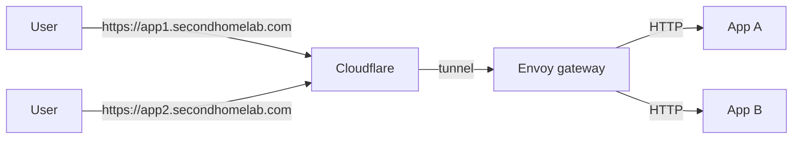

# Envoy Gateway



## Controller installation

With Helm

```bash
helm upgrade \
  --install \
  -n envoy-gateway-system \
  --create-namespace \
  --version v1.8.0 \
  eg oci://docker.io/envoyproxy/gateway-helm
```

## Gateway, EnvoyProxy, GatewayClass

Installed using manifest, same namespace
